# Building a Transformer from Scratch

This is a complete implementation of the transformer architecture from the paper *"Attention Is All You Need"* — written entirely in PyTorch without leaning on any high-level wrappers. Every single component is built by hand: embeddings, positional encoding, multi-head attention, the encoder, the decoder, all of it.

If you have ever used a transformer and wondered what is actually happening inside — this is that walkthrough. It is also useful as a revision reference if you already know the theory and just want to see clean code with explanations next to it.

---

---

## Workflow

1. Input Embedding
2. Positional Encoding
3. Multi-Head Attention
4. Add and Normalization
5. Feed Forward Network
6. Residual Connection
7. Encoder
8. Decoder and Projection Layer
9. Building the Transformer
10. Training and Validation

---

## Libraries

```python
import torch
import torch.nn as nn
import math
import warnings
from pathlib import Path
from torch.utils.data import Dataset, DataLoader, random_split
from torch.utils.tensorboard import SummaryWriter

from tokenizers import Tokenizer
from tokenizers.models import WordLevel
from tokenizers.trainers import WordLevelTrainer
from tokenizers.pre_tokenizers import Whitespace
from datasets import load_dataset

from tqdm import tqdm
```

`torch` and `nn` are the backbone — every neural network component lives here. `SummaryWriter` lets you log training metrics and watch them in TensorBoard on your terminal. From HuggingFace we are only borrowing the tokenizer — its job is to convert raw text into integer IDs. We use `WordLevel` as the tokenizer model, which means every unique word gets one ID, and `Whitespace` as the pre-tokenizer, which splits text on spaces before tokenizing. `WordLevelTrainer` is what actually trains that tokenizer on your dataset. `random_split` handles the 80/20 train and validation split, and `tqdm` gives you the progress bars so training does not feel like staring at a blank screen.

---

## 1. Input Embedding

Before anything else, we need to convert words into numbers the model can actually work with. The way this works is straightforward — every word in your vocabulary gets assigned a unique index.

```
Sentence:   "my name is Himanshu"
Tokens:     "my"   "name"   "is"   "Himanshu"
Index:        0       1       2        3
```

The vocabulary is just the list of all unique words across your dataset. Each word appears exactly once with its own index — no repeats. So the sentence above becomes `[0, 1, 2, 3]`, which you can always decode back to the original words by looking at the vocabulary.

Now, these integers on their own are not useful for a neural network. They carry no meaning — the number 3 does not tell you anything about the word "Himanshu". So we convert each index into a dense vector of 512 numbers. This is the embedding, and this is where things get interesting.

No one in the world actually knows what each individual number in that 512-dimensional vector represents. But what we do know is that after training, words with similar meanings end up with similar vectors. If you were to plot them, "animal" and "human" would sit close to each other, while "banana" would be far away from both. The model figures this out entirely on its own during training — nobody told it to. If you want to go deeper into this, look up word2vec.

The dimension of this vector — 512 — is called `d_model` and it stays consistent throughout the entire transformer. Everything passes through as 512 dimensions.

### Context Window

Before we look at the code, there is one more concept worth understanding — the context window. Take the sentence "An animal is dancing in the jungle." If your context window is 1, the model can only look at one word before and after the target word. So for the word "is", it can only see "animal" and "dancing".

The way embeddings are actually learned is through a simple prediction task. We train a small model — just a linear layer with 512 hidden units — where the weights become the embeddings. The model learns to predict context words from a target word and vice versa. So if we feed in "the", it should predict "animal". If we feed in "animal", it should predict both "is" and "the". The weights of this model, after training, are what we use as our embedding lookup table. The model has been forced to encode meaning into those 512 numbers because that is the only way to get the prediction right.

```python
class InputEmbeddings(nn.Module):
    def __init__(self, d_model: int, vocab_size: int):
        super().__init__()
        self.d_model = d_model
        self.vocab_size = vocab_size
        self.embedding = nn.Embedding(vocab_size, d_model)

    def forward(self, x):
        return self.embedding(x) * math.sqrt(self.d_model)
```

`nn.Embedding` is a lookup table — `vocab_size` rows, `d_model` columns. You hand it a tensor of word indices and it hands back the corresponding 512-dimensional vectors. The multiplication by `math.sqrt(d_model)` comes straight from the original paper. As `d_model` grows larger, the embedding values naturally get smaller in scale. Multiplying by the square root brings them back up so they stay compatible with the positional encodings we are about to add on top — otherwise the positional signal would drown out the word meaning.

The shape transformation looks like this:

```
Input:   [102, 450, 12, 8943]     shape: (1, 4)        — 1 sentence, 4 words
Output:  embedding vectors         shape: (1, 4, 512)   — 1 sentence, 4 words, 512 dims each
```

---

## 2. Positional Encoding

Here is a problem that is easy to miss. A transformer processes all words at the same time in parallel — unlike an RNN which reads left to right. That is great for speed, but it means the model has no idea that "dog bites man" and "man bites dog" are different sentences. Both contain the exact same words with the exact same embeddings, just in a different order. Without something extra, the model treats them as identical.

Positional encoding solves this by adding a unique signal to each word's embedding that encodes where in the sentence that word sits.

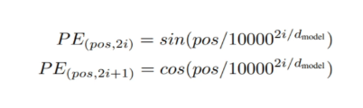

The formula from the paper:

$$PE_{(pos,\ 2i)} = \sin\left(\frac{pos}{10000^{2i/d_{model}}}\right)$$

$$PE_{(pos,\ 2i+1)} = \cos\left(\frac{pos}{10000^{2i/d_{model}}}\right)$$

Where `pos` is the position of the word in the sentence and `i` is the index along the 512 dimensions. Even dimensions get sine, odd dimensions get cosine. So for the word "The" with embedding `[0.2, 0.3, ...]`, we apply sine to the value at index 0, cosine to the value at index 1, and continue alternating for all 512 dimensions. For a word at position 1, the values are slightly different. Every position ends up with a unique fingerprint across all 512 dimensions.

These encodings are not learned — they are fixed math. A nice side effect of using sine and cosine is that the values always stay between -1 and 1, which also handles normalization.

```python
class PositionalEncoding(nn.Module):
    def __init__(self, d_model: int, seq_len: int, dropout: float):
        super().__init__()
        self.d_model = d_model
        self.seq_len = seq_len
        self.dropout = nn.Dropout(dropout)

        # Create a blank canvas of shape (seq_len, d_model)
        pe = torch.zeros(seq_len, d_model)

        # A column vector of positions: [0, 1, 2, ..., seq_len-1], shape (seq_len, 1)
        # unsqueeze(1) adds a dimension so shape goes from (seq_len,) to (seq_len, 1)
        position = torch.arange(0, seq_len, dtype=torch.float).unsqueeze(1)

        # The denominator rewritten in log-space for numerical stability
        div_term = torch.exp(
            torch.arange(0, d_model, 2).float() * (-math.log(10000.0) / d_model)
        )

        # Even columns (0, 2, 4...) get sine, odd columns (1, 3, 5...) get cosine
        pe[:, 0::2] = torch.sin(position * div_term)
        pe[:, 1::2] = torch.cos(position * div_term)

        # Add batch dimension: (seq_len, d_model) -> (1, seq_len, d_model)
        pe = pe.unsqueeze(0)

        # Save as a buffer — not a learned parameter, but saved with the model
        self.register_buffer('pe', pe)

    def forward(self, x):
        x = x + (self.pe[:, :x.shape[1], :]).requires_grad_(False)
        return self.dropout(x)
```

`torch.zeros(seq_len, d_model)` creates the blank canvas — say `seq_len=5000` and `d_model=512`, that is a 5000×512 matrix to fill in.

`torch.arange(0, seq_len).unsqueeze(1)` gives us a column of position numbers from 0 to 4999. The `.unsqueeze(1)` adds a dimension so the shape goes from `(seq_len,)` to `(seq_len, 1)` — this makes the broadcasting work correctly when we multiply with `div_term`.

The denominator in the paper is `10000^(2i/d_model)`. We rewrite it as `exp(2i * -log(10000) / d_model)` because computing it this way is numerically more stable for large values of `d_model`. It is exactly the same math, just a different form that computers handle better. Note the negative sign in `-math.log()` — easy to forget, and getting it wrong silently breaks everything.

`pe[:, 0::2]` means all rows, every even column starting at 0 — those get sine. `pe[:, 1::2]` means all rows, every odd column starting at 1 — those get cosine.

`register_buffer` tells PyTorch — save this matrix inside the model, move it to the GPU if needed, but do not update it during training. It is fixed math, not a learnable weight.

In the forward pass we slice `pe` to match the actual input length, since most sentences will be shorter than the maximum `seq_len`. Then we add the positional encoding on top of the embedding and apply dropout to prevent overfitting.

$$\text{Final Vector} = \text{Embedding Vector} + \text{Positional Vector}$$

---

## 3. Multi-Head Attention

This is the heart of the transformer. Everything else around it is essentially support structure.

### Self-Attention

Consider the sentence: *"The man ate the animal because it was hungry."*

What does "it" refer to — the man or the animal? You figured that out using context. Self-attention is how the transformer does the same thing. Every word gets to look at every other word in the sentence and decide how much to pay attention to it.

To do this, three things are computed from each word — query, key, and value. Think of it like this: the query is what a word is looking for, the key is what a word is advertising that it contains, and the value is what it actually hands over if selected. The attention score between two words comes from comparing their query and key — like a similarity check. High score means pay a lot of attention, take a lot of the value. Those scores then determine a weighted sum of all the values.

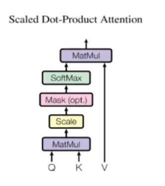

$$\text{Attention}(Q, K, V) = \text{softmax}\left(\frac{QK^T}{\sqrt{d_k}}\right)V$$

First, Q gets multiplied by the transpose of K using matrix multiplication — `@` in PyTorch is the same as `matmul`. Because of how matrix multiplication works, every row of Q gets compared with every column of K^T, which means every word gets compared with every other word. Then we divide by `√d_k` because as dimensions grow larger, the dot products get very large in scale. Large values going into softmax push it into regions where gradients become nearly zero and training grinds to a halt. Dividing by the square root keeps those scores in a reasonable range. Then softmax converts the scores to probabilities, and finally we multiply with V to get the output.

It is called *self*-attention because the query, key, and value all come from the same sentence — the model is looking within itself to understand relationships.

### Masking

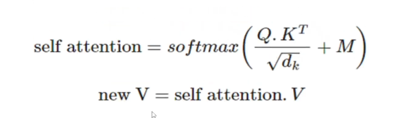

For the decoder, we do not want the model to look at future words when predicting the current one. That would be cheating during training — if the model can already see the answer, it never actually learns anything. So we apply a mask. The mask looks like this — replace 1s with 0 and 0s with -infinity:

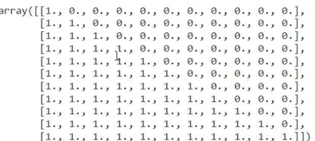

Positions that should not be attended to get set to `-1e9` (a very large negative number) before the softmax. Since `softmax(-∞) = 0`, those positions contribute nothing to the output. The model literally cannot see what comes next. The very first token we send into the decoder output is always a special `<start>` token — the model then generates one word at a time from there.

### Why Multiple Heads

A single attention head looks at the sentence through one lens. But a word like "it" might need to be resolved for grammar in one way and for meaning in another. Multi-head attention runs 8 parallel attention heads simultaneously, each one learning to look at different types of relationships. One head might focus on syntax, another on coreference, another on verb-object relationships.

We have `d_model = 512` and `h = 8` heads, so each head gets `512 / 8 = 64` dimensions to work with. But there is one important thing — we have Q, K, V each of size `(batch, seq_len, 512)`, so they are 3 × 512 total. We split all of them into 8 heads of 64.

```
Q, K, V: (batch, seq_len, 512)
              split into 8 heads
Q, K, V: (batch, 8, seq_len, 64)
              run attention in parallel across all heads
Output:  (batch, 8, seq_len, 64)
              concatenate all heads back together
Output:  (batch, seq_len, 512)
              pass through final linear projection W_o
Output:  (batch, seq_len, 512)
```

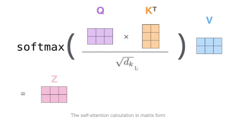

The final `W_o` projection mixes insights from all 8 heads. When you multiply the concatenated 512-vector by this 512×512 matrix, every number interacts with every other number. It acts as the synthesizer — taking a little from head 1, a little from head 4, blending them into one unified representation.

```python
class MultiHeadAttentionBlock(nn.Module):
    def __init__(self, d_model: int, h: int, dropout: float) -> None:
        super().__init__()
        self.d_model = d_model
        self.h = h
        # d_model must be cleanly divisible by h, otherwise we cannot split evenly
        assert d_model % h == 0, 'D_model must be divisible by h'
        self.d_k = d_model // h  # dimension each head works with

        self.w_q = nn.Linear(d_model, d_model)
        self.w_k = nn.Linear(d_model, d_model)
        self.w_v = nn.Linear(d_model, d_model)
        self.w_o = nn.Linear(d_model, d_model)
        self.dropout = nn.Dropout(dropout)

    @staticmethod
    def attention(query, key, value, mask, dropout: nn.Dropout):
        d_k = query.shape[-1]

        # @ is the same as matmul — matrix multiplication
        # (batch, h, seq_len, d_k) @ (batch, h, d_k, seq_len) -> (batch, h, seq_len, seq_len)
        attention_scores = (query @ key.transpose(-2, -1)) / math.sqrt(d_k)

        if mask is not None:
            # Replace masked positions with a very large negative number
            # softmax will turn -1e9 into essentially 0, so those positions are ignored
            attention_scores.masked_fill_(mask == 0, -1e9)

        attention_scores = attention_scores.softmax(dim=-1)

        if dropout is not None:
            attention_scores = dropout(attention_scores)

        # Return both the output and the scores — scores are useful for visualization
        return (attention_scores @ value), attention_scores

    def forward(self, q, k, v, mask):
        query = self.w_q(q)   # (batch, seq_len, 512)
        key   = self.w_k(k)
        value = self.w_v(v)

        # Split into heads
        # (batch, seq_len, 512) -> (batch, seq_len, h, d_k) -> (batch, h, seq_len, d_k)
        # We use .view() instead of .reshape() because view works in-place on the same
        # block of memory rather than creating a copy — more memory efficient
        query = query.view(query.shape[0], query.shape[1], self.h, self.d_k).transpose(1, 2)
        key   = key.view(key.shape[0], key.shape[1], self.h, self.d_k).transpose(1, 2)
        value = value.view(value.shape[0], value.shape[1], self.h, self.d_k).transpose(1, 2)

        x, self.attention_scores = MultiHeadAttentionBlock.attention(query, key, value, mask, self.dropout)

        # Combine heads back together
        # (batch, h, seq_len, d_k) -> (batch, seq_len, h, d_k) -> (batch, seq_len, h * d_k)
        # .contiguous() is needed before .view() because .transpose() makes the memory
        # layout non-contiguous, and .view() requires contiguous memory to work
        # The -1 in view is there to let PyTorch figure out that dimension automatically
        # so we don't have to hardcode the sequence length — easy to forget but important
        x = x.transpose(1, 2).contiguous().view(x.shape[0], -1, self.h * self.d_k)

        return self.w_o(x)
```

`attention` is marked as `@staticmethod` because it does not need anything from `self` — it is a pure function, the same math regardless of which instance calls it. Any instance of the class can call it, and so can the class itself directly, which is what we do: `MultiHeadAttentionBlock.attention(...)`.

`.view()` is used instead of `.reshape()` because view works on the same block of memory without creating a copy. We call `.contiguous()` before the final view because after `.transpose()`, the internal memory layout of the tensor is no longer contiguous (the strides are off), which would make `.view()` fail. `.contiguous()` fixes the memory layout first.

The `-1` inside `.view(x.shape[0], -1, self.h * self.d_k)` tells PyTorch to figure out that middle dimension automatically based on the total number of elements. You could write it out explicitly but you will forget to update it when shapes change, so `-1` is the safer habit.

`masked_fill_` — the underscore means in-place. It modifies the tensor directly rather than returning a new one.

---

## 4. Layer Normalization

After attention, the vectors coming out can have very different scales — some dimensions very large, others very small. This makes training unstable because the gradients behave differently in different parts of the network. Layer normalization standardizes each vector by subtracting its mean and dividing by its standard deviation.

$$\hat{x} = \frac{x - \mu}{\sigma + \epsilon}$$

Then two learnable parameters are applied on top:
- **alpha** scales the output (starts at 1)
- **bias** shifts the output (starts at 0)

The reason we give the model these is simple: what if the perfectly normalized value is not actually the best value for learning? Maybe for some layer, slightly larger values work better. Alpha and bias let the model find the right scale and shift during training. They start at 1 and 0 so initially normalization works exactly as expected, and the model can move them from there.

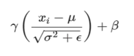

```python
class LayerNormalization(nn.Module):
    def __init__(self, eps: float = 1e-6) -> None:
        super().__init__()
        self.eps   = eps
        self.alpha = nn.Parameter(torch.ones(1))   # learnable scale, starts at 1
        self.bias  = nn.Parameter(torch.zeros(1))  # learnable shift, starts at 0

    def forward(self, x):
        mean = x.mean(dim=-1, keepdim=True)
        std  = x.std(dim=-1, keepdim=True)
        return self.alpha * (x - mean) / (std + self.eps) + self.bias
```

`dim=-1` means we compute the mean and standard deviation across the last dimension — the 512 features of each individual token. Each token gets its own mean and std, completely independent of other tokens in the batch. This is what makes it layer normalization rather than batch normalization — we normalize across features, not across samples.

`keepdim=True` keeps the shape as `(batch, seq_len, 1)` instead of collapsing that dimension, so that the subtraction and division broadcast correctly against the original shape.

`eps` — a tiny value like `1e-6` — is added to the standard deviation to avoid dividing by zero when std happens to be very small.

`nn.Parameter` wraps a tensor and marks it as a learnable weight — PyTorch will include alpha and bias when the optimizer runs its update step. Currently we are writing this for a single sentence but the code handles batches of sentences just fine as well.

Benefits of layer normalization: faster training, more stable gradients, and it reduces covariate shift — the problem where the distribution of inputs to a layer keeps changing as earlier layers update during training.

---

## 5. Feed Forward Network

After the attention layer has done the work of mixing information between tokens, each token's vector goes through a small independent neural network. This is the feed forward block — two linear layers with a ReLU activation in between and a dropout in the middle.

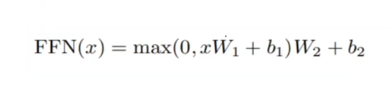

```
Input (512)  ->  Linear  ->  ReLU  ->  Dropout  ->  Linear  ->  Output (512)
                              inner layer = 2048
```

It expands from 512 to 2048 and then compresses back to 512. The reason for expanding first is to give the model more room to perform a complex non-linear transformation before projecting back to the original size. More dimensions = more expressive power in that middle step.

This is applied position-wise — every token goes through the exact same FFN independently of every other token. There is no mixing between tokens here. That already happened in attention.

```python
class FeedForwardBlock(nn.Module):
    def __init__(self, d_model: int, d_ff: int, dropout: float) -> None:
        super().__init__()
        self.linear_1 = nn.Linear(d_model, d_ff)
        self.dropout  = nn.Dropout(dropout)
        self.linear_2 = nn.Linear(d_ff, d_model)

    def forward(self, x):
        # Step by step, this is what is happening:
        # b = self.linear_1(x)       expand: (batch, seq_len, 512) -> (batch, seq_len, 2048)
        # s = torch.relu(b)          apply ReLU non-linearity
        # e = self.dropout(s)        randomly zero some values to prevent overfitting
        # z = self.linear_2(e)       compress back: (batch, seq_len, 2048) -> (batch, seq_len, 512)
        #
        # Written in one line (same thing, just more compact):
        return self.linear_2(self.dropout(torch.relu(self.linear_1(x))))
```

---

## 6. Residual Connection

When you stack 6 encoder blocks on top of each other, you have a deep network. During backpropagation, the gradient signal has to travel all the way back through every single layer to update the weights in the early layers. By the time it reaches those early layers, it can become so small it is essentially zero — this is the vanishing gradient problem. Early layers stop learning, and the whole network suffers for it.

The fix is a skip connection. At every sub-layer, the input is added directly to the output:

$$\text{Output} = x + \text{Sublayer}(\text{LayerNorm}(x))$$

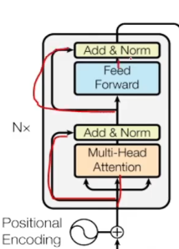

Even if the sublayer learns something unhelpful, the original signal `x` flows through untouched via the addition. It is a highway that keeps information — and gradients — alive no matter how deep the network goes.

```python
class ResidualConnection(nn.Module):
    def __init__(self, dropout: float) -> None:
        super().__init__()
        self.dropout = nn.Dropout(dropout)
        self.norm    = LayerNormalization()

    def forward(self, x, sublayer):
        # The most basic version would be:
        # return x + self.norm(sublayer(x))
        # normalize after sublayer, then add — this is what the original paper did (post-norm)
        #
        # Adding dropout for regularization:
        # return x + self.dropout(self.norm(sublayer(x)))
        #
        # But based on advice from researchers, applying norm *before* the sublayer
        # (pre-norm) trains more stably. So the final version is:
        return x + self.dropout(sublayer(self.norm(x)))
```

The evolution of those three lines tells you something important about how real research works — the original paper had one approach, and people later found a small tweak that works better in practice. Pre-norm vs post-norm is a real debate in the transformer literature.

---

## 7. Encoder

One encoder block is multi-head attention followed by a feed forward network, each one wrapped in a residual connection. The original paper stacks N = 6 of these blocks.

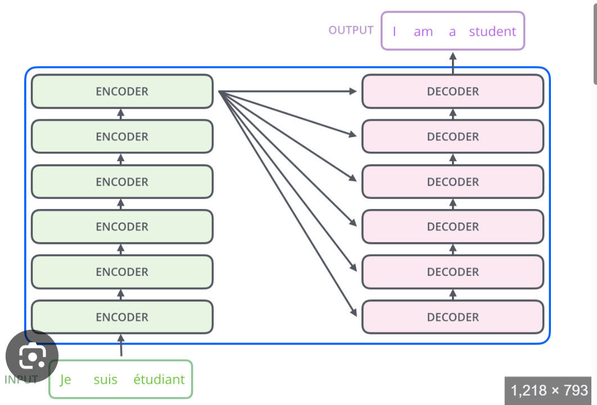

The `src_mask` passed into the forward method handles padding. Sentences in a batch have different lengths, and shorter ones get padded with a special `<pad>` token to match the longest sentence in the batch. The mask tells the attention mechanism to ignore those padding positions — we do not want actual words attending to meaningless filler tokens.

```python
class EncoderBlock(nn.Module):
    def __init__(self, self_attention: MultiHeadAttentionBlock,
                 feed_forward_block: FeedForwardBlock, dropout: float) -> None:
        super().__init__()
        self.self_attention_block = self_attention
        self.feed_forward_block   = feed_forward_block
        # Each encoder block has exactly 2 residual connections:
        # one wrapping the attention sublayer, one wrapping the feed forward sublayer
        # nn.ModuleList is used to store these so PyTorch properly tracks them as
        # submodules — if you used a plain Python list, PyTorch would not register
        # them and their parameters would not be updated during training
        self.residual_connections = nn.ModuleList([ResidualConnection(dropout) for _ in range(2)])

    def forward(self, x, src_mask):
        # residual_connections[0] wraps the self-attention sublayer
        # We use a lambda here because ResidualConnection.forward expects a function
        # it can call as sublayer(x) — the lambda lets us pass the mask along too
        # without changing the interface. q, k, v all receive x because this is
        # self-attention: every word looks at every other word in the same sentence
        x = self.residual_connections[0](x, lambda x: self.self_attention_block(x, x, x, src_mask))
        # residual_connections[1] wraps the feed forward sublayer
        x = self.residual_connections[1](x, self.feed_forward_block)
        return x
```

After all 6 blocks, there is a final layer normalization before the output goes to the decoder.

```python
class Encoder(nn.Module):
    def __init__(self, layers: nn.ModuleList) -> None:
        super().__init__()
        self.layers = layers
        self.norm   = LayerNormalization()

    def forward(self, x, mask):
        for layer in self.layers:
            x = layer(x, mask)
        return self.norm(x)
```

The encoder's final output is a rich, context-aware representation of every word in the source sentence. This is what gets handed to the decoder — the key and value matrices come from here.

---

## 8. Decoder and Projection Layer

The decoder is where the model generates the output — one word at a time. It looks similar to the encoder but has three sub-layers instead of two, and the middle one is what connects everything to the encoder.

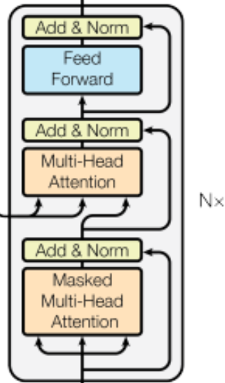

**Masked Self-Attention** — the decoder first attends to its own previously generated tokens. The target mask ensures it cannot look at future positions. This is what makes generation autoregressive — the model can only use what it has already produced when predicting the next word.

**Cross-Attention** — this is the bridge. The queries come from the decoder — what the decoder is currently thinking about — but the keys and values come from the encoder output. So the decoder is asking: given what I have generated so far, which parts of the original source sentence should I focus on right now? This is where the two halves of the transformer actually communicate with each other.

**Feed Forward** — same as in the encoder, a position-wise transformation applied to each token independently.

```python
class DecoderBlock(nn.Module):
    def __init__(self, self_attention: MultiHeadAttentionBlock,
                 cross_attention: MultiHeadAttentionBlock,
                 feed_forward_block: FeedForwardBlock, dropout: float) -> None:
        super().__init__()
        self.self_attention_block  = self_attention
        self.cross_attention_block = cross_attention
        self.feed_forward_block    = feed_forward_block
        # Three residual connections this time — one per sublayer
        self.residual_connections  = nn.ModuleList([ResidualConnection(dropout) for _ in range(3)])

    def forward(self, x, encoder_output, src_mask, target_mask):
        # Self-attention over the decoder's own output so far
        x = self.residual_connections[0](x, lambda x: self.self_attention_block(x, x, x, target_mask))
        # Cross-attention: queries from decoder, keys and values from encoder
        x = self.residual_connections[1](x, lambda x: self.cross_attention_block(x, encoder_output, encoder_output, src_mask))
        x = self.residual_connections[2](x, self.feed_forward_block)
        return x


class Decoder(nn.Module):
    def __init__(self, layers: nn.ModuleList) -> None:
        super().__init__()
        self.layers = layers
        self.norm   = LayerNormalization()

    def forward(self, x, encoder_output, src_mask, target_mask):
        for layer in self.layers:
            x = layer(x, encoder_output, src_mask, target_mask)
        return self.norm(x)
```

### Projection Layer

After the decoder, each position has a 512-dimensional vector. We need to turn that into an actual word from the vocabulary. The projection layer maps from 512 to `vocab_size` — say 30,000 — and then softmax converts those numbers into probabilities. The word with the highest probability is what the model outputs for that position.

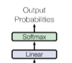

```python
class ProjectionLayer(nn.Module):
    def __init__(self, d_model: int, vocab_size: int) -> None:
        super().__init__()
        self.proj = nn.Linear(d_model, vocab_size)

    def forward(self, x):
        return torch.log_softmax(self.proj(x), dim=-1)
```

We use `log_softmax` instead of regular softmax for numerical stability — working with log probabilities avoids underflow issues that happen when probabilities are very small numbers.

This is also the reason ChatGPT, Gemini, and every other language model is called a next-word predictor. Every single forward pass is doing exactly this — given everything so far, which word in the vocabulary is most likely to come next. That is the entire mechanism. Whether that constitutes real intelligence is a different conversation.

---

## 9. Building the Transformer

Now everything gets assembled into one class and one build function.

```python
class Transformer(nn.Module):
    def __init__(self, encoder: Encoder, decoder: Decoder,
                 src_embed: InputEmbeddings, target_embed: InputEmbeddings,
                 src_pos: PositionalEncoding, target_pos: PositionalEncoding,
                 projection_layer: ProjectionLayer) -> None:
        super().__init__()
        self.encoder          = encoder
        self.decoder          = decoder
        self.src_embed        = src_embed
        self.target_embed     = target_embed
        self.src_pos          = src_pos
        self.target_pos       = target_pos
        self.projection_layer = projection_layer

    def encode(self, src, src_mask):
        src = self.src_embed(src)
        src = self.src_pos(src)
        return self.encoder(src, src_mask)

    def decode(self, encoder_output, src_mask, target, target_mask):
        target = self.target_embed(target)
        target = self.target_pos(target)
        return self.decoder(target, encoder_output, src_mask, target_mask)

    def project(self, x):
        return self.projection_layer(x)
```

The build function is the factory that wires everything together with the right dimensions. Notice it is a plain function, not a class — its only job is to create and return a fully initialized Transformer.

```python
def build_transformer(src_vocab_size: int, target_vocab_size: int,
                      src_seq_len: int, target_seq_len: int,
                      d_model: int = 512, N: int = 6, h: int = 8,
                      dropout: float = 0.1, d_ff: int = 2048) -> Transformer:

    # Source and target have separate embedding layers because their vocabularies
    # are different (e.g. English vocabulary vs French vocabulary)
    src_embed    = InputEmbeddings(d_model, src_vocab_size)
    target_embed = InputEmbeddings(d_model, target_vocab_size)

    src_pos    = PositionalEncoding(d_model, src_seq_len, dropout)
    target_pos = PositionalEncoding(d_model, target_seq_len, dropout)

    encoder_blocks = []
    for _ in range(N):
        encoder_self_attention = MultiHeadAttentionBlock(d_model, h, dropout)
        feed_forward           = FeedForwardBlock(d_model, d_ff, dropout)
        encoder_block          = EncoderBlock(encoder_self_attention, feed_forward, dropout)
        encoder_blocks.append(encoder_block)

    decoder_blocks = []
    for _ in range(N):
        decoder_self_attention  = MultiHeadAttentionBlock(d_model, h, dropout)
        decoder_cross_attention = MultiHeadAttentionBlock(d_model, h, dropout)
        feed_forward            = FeedForwardBlock(d_model, d_ff, dropout)
        decoder_block           = DecoderBlock(decoder_self_attention, decoder_cross_attention, feed_forward, dropout)
        decoder_blocks.append(decoder_block)

    encoder          = Encoder(nn.ModuleList(encoder_blocks))
    decoder          = Decoder(nn.ModuleList(decoder_blocks))
    projection_layer = ProjectionLayer(d_model, target_vocab_size)

    transformer = Transformer(encoder, decoder, src_embed, target_embed,
                              src_pos, target_pos, projection_layer)

    # Initialize weights using Xavier uniform
    # We only apply this to parameters with more than 1 dimension —
    # that means weight matrices get initialized, but 1D bias vectors do not
    # (biases are fine starting at zero)
    for p in transformer.parameters():
        if p.dim() > 1:
            nn.init.xavier_uniform_(p)
            # The _ at the end means in-place — modifies the parameter directly,
            # no copy made

    return transformer
```

The weight initialization at the end uses Xavier uniform. The idea is that the variance of a layer's outputs should roughly match the variance of its inputs. If 512 numbers go into a linear layer, the 512 numbers that come out should not be drastically larger or smaller. If variance keeps growing as you go deeper, gradients explode. If it keeps shrinking, they vanish. Xavier sets the initial weights so that this variance is preserved across layers, which gives training a much better starting point.

---

## Quick Reference

| Component | What it does | Key parameter |
|---|---|---|
| Input Embedding | Word index to 512-dim vector | `d_model = 512` |
| Positional Encoding | Adds position signal to each embedding | `seq_len` = max sentence length |
| Multi-Head Attention | Every word attends to every other word | `h = 8` heads |
| Layer Normalization | Stabilizes values after each sub-layer | `eps = 1e-6` |
| Feed Forward Network | Non-linear transform per position | `d_ff = 2048` |
| Residual Connection | Keeps original signal alive through depth | — |
| Encoder | 6 stacked attention + FFN blocks | `N = 6` |
| Decoder | 6 stacked blocks with cross-attention | `N = 6` |
| Projection Layer | 512-dim vector to vocabulary probabilities | `vocab_size` |

---

## References

- Vaswani et al., [Attention Is All You Need](https://arxiv.org/abs/1706.03762), 2017
- Jay Alammar, [The Illustrated Transformer](https://jalammar.github.io/illustrated-transformer/)
- [PyTorch Documentation](https://pytorch.org/docs/stable/index.html)